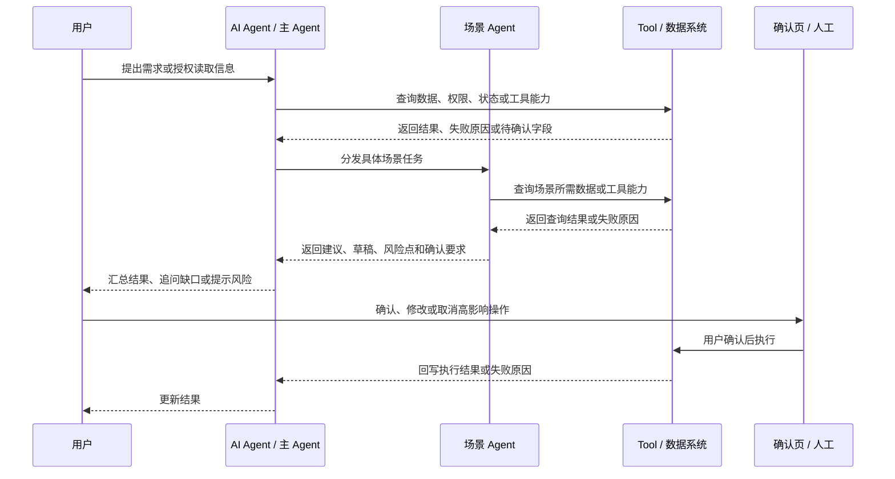

# PRD-writer

这个 skill 只用于一件事：输出 PRD。

禁止把这个 skill 用于报告、机会判断、审阅摘要、邮件、幻灯片、复盘、竞品分析或单纯建议。用户没有要求输出 PRD 时，不使用这个 skill。

## 输出前必须先确认目标

从零产出 PRD 正文前，必须先确认目标。没有确认目标之前，只能提出问题或复述待确认目标，不能输出 PRD 正文、章节草稿或完整文档。

如果用户是在已有 PRD 上要求修改、去重、审视、补充或写回，且产品对象、来源文档和修改范围已经明确，不重复要求确认 PRD 目标。此时必须先读取用户指定的最新文档，以用户线上最新版本为准，不用本地旧稿或先前覆盖版本反推。

默认读者固定为研发、设计、测试、运营。写作时必须让这四类读者能理解需求、流程、规则、依赖和验收方式。

必须确认以下信息：

- 这个 PRD 要定义的产品、功能或业务对象是什么。
- 这个 PRD 要解决的核心问题是什么。
- 已有素材有哪些：飞书文档、截图、调研、会议纪要、口头描述或本地文件。
- 当前范围是否明确；如果范围不明确，必须先问清楚纳入范围和不纳入范围。
- 是否需要写入飞书；如果需要，是否必须保留原文档中的图片、表格、画板或附件。

## 输出标准

Markdown 交付时，PRD 正文从 `# 产品 / 模块名称 PRD` 开始。飞书交付时，可以使用飞书文档标题作为 title，正文从 `# 1. 背景与目标` 开始。

输出必须严格使用 `PRD 固定结构` 的章节顺序和标题。资料不足时，在对应章节标注 `待确认` / `TBD`，并说明影响哪条需求、规则或验收。禁止在 PRD 正文外写说明、总结、备注或下一步。

默认使用中文。必要英文术语可以保留，例如 `agent`、`query`、`API`、`LLM`、`handoff payload`。AI 能力必须写成产品规则、约束和验收要求，不写模型宣传。

正式飞书稿要保留阅读节奏。一级章节、二级章节、表格、画板、图片和代码块之间留空行；用户已经手动调整过的空行和段落节奏，后续改稿优先保留。

## 写作风格与去重原则

PRD 要像项目负责人写给研发、设计、测试、运营的工作文档。语言清楚、直接、专业，但不能像模板填充或 AI 总结。

写作时优先使用 `事实 + 判断 + 动作`。避免营销式表达、空泛结论和机械连接词。无法验收的效果承诺，必须改成触发条件、字段、执行动作和失败处理。

章节之间必须有明确分工。同一条规则、限制、兜底或依赖只放在一个主要章节里；其他章节需要关联时，用短句引用，不复制原句。

章节职责按以下规则处理：

- `2.1 产品定位` 说明产品范围和主要能力，不展开完整规则。
- `3.1 场景总览` 统一场景口径，并写清不承载的范围；`3.3 核心场景表` 只写入口、用户状态、具体需求和典型输入。
- `4.2 角色协作与能力说明` 列出角色、场景 Agent 和工具 / 数据系统，命名必须与 `5-9` 保持一致。
- `5. 需求清单` 只做索引，写需求项、承接角色、用户可视化结果和页面 / 示例；不写字段、规则、依赖和兜底。
- `6. 需求详情` 是规则主章节，写清规则、字段与判断、兜底方式和验收方式。
- `7.1` 只写意图和路由；`7.2` 只写跨需求字段组和追问限制；`7.3` 只写路由、调度和 Agent 握手时机；`7.5` 只写禁止事项、无法完成、异常输入和兜底处理。
- `8. 数据、内容与后台依赖` 只写依赖域、所需能力和处理要求。涉及第三方 App、厂商、API、区域覆盖或 App 跳转时，必须在这里集中说明。
- `9. 验收标准与评估指标` 只写 EVAL 和量化指标，不复述字段定义、依赖来源和需求背景。
- `10. 风险与待确认问题` 只写会影响方案或验收的未决问题，不逐行搬运第 8 章依赖。

角色命名必须具体。需要区分 `用户`、`主 Agent`、`场景 Agent`、`Tool / 数据系统`、`确认页`、`运营后台`、`人工` 等对象。禁止用含糊的“系统”代替真实执行方，只有执行方不重要时才使用“系统”。

涉及 Agent 的 PRD 还必须满足以下要求：

- `2.1`、`4.2`、`5-9` 的 Agent 名称和承接关系一致。
- 场景 Agent 默认不直接互相调用。由主 Agent 维护行程、任务或会话状态，再分发给对应场景 Agent。
- 多个 Agent 协作时，在 `7.3` 写清一个场景 Agent 到下一个场景 Agent 的握手时机。
- `7.5` 写清 Agent 禁止执行的动作、无法完成的情况、场景范围外输入，以及出现后的提示、转人工或手动路径。
- `9` 用 EVAL 样本、通过条件、失败判定和量化成功率评估 Agent 能力。

## 禁止事项

以下规则是硬性约束。最终输出中出现任一问题，都视为不合格，必须返工。

- 禁止输出亮点总结、摘要、结论先行、版本信息、日期、负责人、修订记录、作者说明、生成说明。
- 禁止输出结构外内容。PRD 正文之外不能出现解释、建议、下一步、备注或聊天式说明。
- 正文内可以少量加粗关键判断、典型场景标签或强约束。禁止把加粗当成亮点总结、营销话术或结构外摘要。
- 禁止写 `首版`、`MVP`、`P0`、`P1`、`优先级`、`一期`、`二期`、`分期计划`、`后续迭代`、`路线图`、`当前版本 / 后续版本` 等阶段或优先级表达。
- 禁止在需求清单、核心场景、验收标准或任何表格中增加优先级列。
- 禁止默认在标题下保留 Demo、原型、访问码或生成说明；用户明确要求保留时，放在对应页面 / 示例或附件位置。
- 禁止使用通用对比句式，包括 `不是A，而是B`、`不取决于A，而取决于B`、`真实价值点不在A，而在B`。
- 禁止使用没有具体定义的抽象词，包括 `赋能`、`抓手`、`闭环`、`底层逻辑`、`控制点`、`边界`、`能力分层`。
- 禁止用大而空的判断替代具体规则，例如只写“提升体验”“智能推荐”“精准匹配”，却不说明触发条件、输入字段、执行动作和验收方式。
- 禁止编造用户反馈、市场事实、数据指标、产品行为、上线时间、团队依赖或来源结论。
- 禁止把不确定信息写成确定结论。所有未知项必须标注为 `待确认` / `TBD`。

## PRD 固定结构

必须严格按以下结构输出：

```markdown
# 产品 / 模块名称 PRD

# 1. 背景与目标
## 1.1 背景
## 1.2 产品目标
## 1.3 成功指标

# 2. 产品定位与目标用户
## 2.1 产品定位
## 2.2 目标用户
## 2.3 用户痛点与典型需求

# 3. 核心场景
## 3.1 场景总览
## 3.2 用户体验旅程图
## 3.3 核心场景表

# 4. 方案总览
## 4.1 业务流程图
## 4.2 角色协作与能力说明

# 5. 需求清单

# 6. 需求详情

# 7. AI 能力与规则
## 7.1 意图识别
## 7.2 字段抽取与追问
## 7.3 路由规则
## 7.4 记忆、权限与人工接管
## 7.5 异常与兜底

# 8. 数据、内容与后台依赖

# 9. 验收标准与评估指标

# 10. 风险与待确认问题
```

## 必备图示

以下两类图是 PRD 必备内容。缺少任一图，PRD 视为不完整。

### 核心场景必须包含用户体验旅程图

`3.2` 必须以附件式画板 / 图片输出用户体验旅程。禁止用 Mermaid、纯文字列表或表格替代；旧 Mermaid 旅程图需要重画。画板标题固定为 `用户体验旅程`。

旅程图采用四层横向结构：`旅程阶段 / 发生`、`对应核心场景`、`痛点`、`期望`。阶段从左到右推进，通常 5-8 个。每一列必须能映射到 `3.3 核心场景表`，覆盖从触发、提出需求、理解、补全、确认到结束的主线。

节点文案必须写当前业务的真实发生、负担和期望结果。涉及 AI、人工、数据系统或工具能力时，写用户能感知到的结果。禁止使用“进入下一步”“系统处理”“优化体验”等空泛节点。

检查线上 PRD 时，必须查看画板预览或原始节点，确认结构、映射关系和可读性，不能只看 `<whiteboard>` 占位。

### 方案总览必须包含业务流程图

`4.1` 必须用 Mermaid 或画板画出业务流程图。流程图要说明用户、主 Agent、场景 Agent、Tool / 数据系统、确认页、人工或运营后台之间的交互顺序。

流程图必须区分用户可感知动作、Agent / 工具内部动作和人工服务动作。涉及外部数据、第三方服务或 AI 转人工时，写清查询对象、返回内容、触发条件、交接内容和确认动作。

推荐 Mermaid 模板：



## 必备表格

以下表头为默认硬约束，标注可扩展的表除外。除非用户明确要求延续线上已有列名，否则不得删列、改列或新增优先级列。

### 核心场景表

```markdown
| 场景分类 | 用户状态 / 触发条件 | 具体需求 | 典型输入 |
|-|-|-|-|
```

如果用户的线上文档已使用 `典型 Query` 或 `典型Query` 作为列名，后续修改时保留线上列名，不为统一模板强行改回 `典型输入`。

### 角色协作与能力说明表

```markdown
| 序号 | 角色 / Agent | 能力说明 |
|-|-|-|
```

### 需求清单表

```markdown
| 序号 | 需求项 | 承接角色 | 用户可视化 | 页面 / 示例 |
|-|-|-|-|-|
```

如果没有截图或页面示意，可以去掉 `页面 / 示例` 列；如果已有飞书图片，必须保留，不能因为重写需求清单而删除。

### 需求详情表

```markdown
| 序号 | 需求项 | 执行方 | 规则 | 字段与判断 | 兜底方式 | 验收方式 |
|-|-|-|-|-|-|-|
```

`规则` 单元格里不要重复写执行方名称。`字段与判断` 单元格里不要写“判断字段”“字段判断”等重复表头的词，直接写字段和判断关系。

### 意图识别表

```markdown
| 识别意图 | 识别依据 | 路由对象 |
|-|-|-|
```

### 字段抽取与追问表

```markdown
| 字段组 | 关联需求 | 抽取内容 | 追问与限制 |
|-|-|-|-|
```

### Agent 握手与状态流转表

```markdown
| 行程状态 | 当前处理 | 触发时机 | 承接对象 |
|-|-|-|-|
```

状态流转表保持简洁，不增加字段、兜底、依赖或验收列。字段和兜底回到第 6 章或 `7.5` 处理。

### 异常与兜底表

```markdown
| 异常 / 限制 | 禁止事项 | 出现时处理 | 关联需求 |
|-|-|-|-|
```

### 数据依赖表

基础依赖表：

```markdown
| 对应需求 | 依赖项 | 用途 |
|-|-|-|
```

涉及第三方 App、厂商、API、区域覆盖、App 跳转或企业系统时，使用扩展依赖表：

```markdown
| 依赖域 | 国内 / 本地依赖示例 | 海外 / 外部依赖示例 | 所需能力 | 关联需求 | 用途 / 处理要求 |
|-|-|-|-|-|-|
```

第 8 章只写依赖和处理要求；第三方不可用时的失败样本放在第 9 章，接入范围和区域覆盖的未决问题放在第 10 章。

### EVAL 表

```markdown
| 评估对象 | 覆盖需求 | EVAL 样本 | 通过条件 | 失败判定 |
|-|-|-|-|-|
```

### 量化指标表

```markdown
| 指标 | 计算口径 | 目标值 | 覆盖对象 |
|-|-|-|-|
```

量化指标要覆盖意图识别、字段提取、关键任务生成、高影响操作拦截、异常兜底、第三方服务回退和多 Agent 协作。没有真实数据时可以标注 `TBD`，但计算口径必须可执行。

### 风险与待确认问题表

```markdown
| 待确认问题 | 影响范围 | 需要明确的内容 |
|-|-|-|
```

## 需求详情写法

每条需求都要写成可执行的产品规则：

- 先写用户、Agent、工具或人工做了什么。
- 再写执行方如何响应。
- 再写需要的字段、判断规则和兜底方式。
- 容易误解的规则必须加例子。
- 所有规则都要能落到验收标准。
- 同一需求中的规则、字段、兜底和验收要能互相对上，避免清单写一套、详情写一套、EVAL 又写另一套。
- 高影响操作必须写清确认页或人工确认，例如写入、下单、下载、保存、共享、发送、删除、支付、审批。
- Agent 无法完成时，要写清限制原因、用户可见提示和可恢复路径。
- 用户输入超出产品场景时，必须明确拒识或降级处理，不能把普通需求包装成场景内服务。
- 第三方服务、厂商 API 或工具能力不可用时，只能展示失败原因、可替代入口、手动路径或待确认状态，不能写成已执行或确定结论。
- 例子只用于解释容易误解的规则，避免把示例扩写成另一套需求。

## 交付前验收

交付前逐项检查：

- 文档起点、章节顺序和章节标题完全符合 `PRD 固定结构`。
- 文档没有违反 `禁止事项`，也没有结构外说明、阶段 / 版本 / 优先级表达。
- 一级章节、二级章节、表格、画板、图片和代码块之间按换行规则排版。
- `3.2` 有附件式四层横向用户体验旅程图，且“对应核心场景”能映射到 `3.3 核心场景表`。
- `4.1` 有业务流程图；`4.2` 写清角色、场景 Agent 和工具 / 数据系统。
- 所有必备表格表头齐全，内容符合章节职责分工，没有跨章节大段重复或相似表达。
- 需求详情中的规则、字段、兜底和验收能互相对上，未确认项标注 `TBD` / `待确认` 并说明影响范围。
- 涉及 Agent 时，必须包含场景 Agent 列表、握手时机、场景范围外输入、禁止事项 / 无法完成处理、Agent EVAL 和量化指标。
- 涉及第三方服务时，第 8 章写依赖，第 9 章写回退 EVAL / 成功率，第 10 章只保留接入范围、区域覆盖、API / App 跳转等未决问题。
- 交付前做一轮 AI 味清理：删掉空泛判断、营销语、含糊“系统”和重复规则，改成具体执行方、触发条件和用户可见结果。

## 飞书交付规则

当用户要求写入飞书时：

- 使用 `lark-doc` 读取、创建或更新文档。
- 除非用户明确要求替换，否则保留原文档中有价值的图片、画板、表格和资源块。
- 密集需求信息优先用表格表达。
- 核心场景中的用户体验旅程图必须使用附件式画板 / 图片表达，禁止只放 Mermaid、纯文字列表或表格。
- 读取或修改已有 PRD 时，必须检查画板预览或原始节点，确认画板内容与正文核心场景一致。
- 方案总览中的业务流程图必须使用 Mermaid 或画板表达；正式交付优先以画板承载。
- 写回后再次读取文档，核对标题、目录和关键章节。
- 如果用户已经手动修改过线上文档，后续处理必须以线上最新文档为准。
